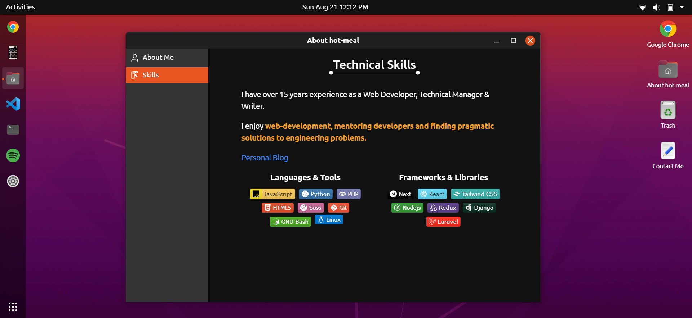

#  Ubuntu Demo

A clone of Ubuntu 20 built with React and Next.js.

     

## Install
`npm i --force`
`npm run build`
`npm start` preview on localhost 
`npm run dev` for local dev

### `npm start`

Runs the app in development mode on [http://localhost:3000](http://localhost:3000).

Includes hot reloading and console based linting.

### `npm run build`

Builds the app for production to the `build` folder.

Bundles React in production mode and optimizes the build for the best performance.

The build is minified and the filenames include the hashes.

See the section about [deployment](https://facebook.github.io/create-react-app/docs/deployment) for more information.

