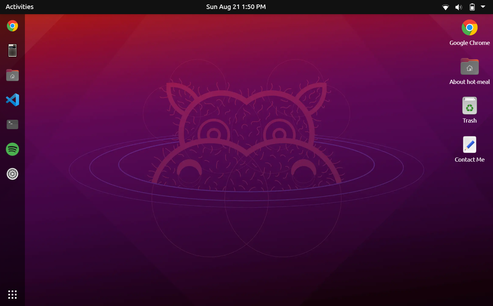

#  Ubuntu Demo

A clone of Ubuntu 20 built with React and Next.js.

[View Demo](https://hot-meal.github.io/ubuntu-demo/)

     

## Install
- `npm i --force`
- `npm run build`
- `npm start` preview on localhost 
- `npm run dev` for local dev

### `npm start`

Runs the app in development mode on [http://localhost:3000](http://localhost:3000).

Includes hot reloading and console based linting.

## Deploy

### Create-react-app method

`npm run build`

Builds the app for production to the `build` folder.

Bundles React in production mode and optimizes the build for the best performance.

### Github Pages method

`npm run export` 

Bundles the next.js app in `out` folder, and uses the github deployment workflow in `.github/workflows`.

